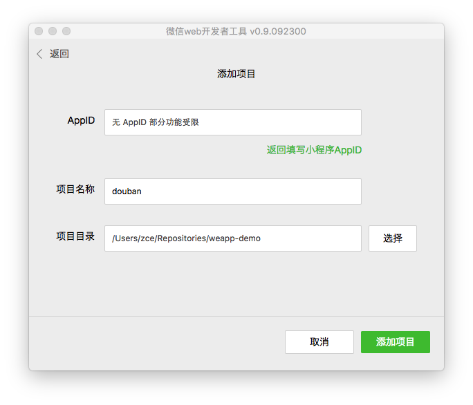

# 微信小程序 Demo（豆瓣电影）

> 由于时间的关系，没有办法写一个完整的说明，后续配合一些视频资料，请持续关注
> https://mp.weixin.qq.com/debug/wxadoc/dev/

## Demo 预览


[演示视频（流量预警 2.64MB）](https://github.com/zce/weapp-demo/blob/master/preview.mp4)

## 使用步骤

1. 将仓库克隆到本地：

	```bash
	$ git clone https://github.com/zce/weapp-demo.git weapp-douban --depth 1
	$ cd weapp-douban
	```

2. 打开`微信Web开放者工具`（注意：必须是`0.9.092300`版本）

	- 必须是`0.9.092300`版本，之前的版本不能保证正常运行
	- 不需要所谓的破解，网上所谓的破解只是针对之前的`0.9.092100`版本，新的官方版本不需要破解，不需要破解，不需要破解！
	- 下载链接（官方版本，放心下载）：https://pan.baidu.com/s/1qYld6Vi
		* `wechat_web_devtools_0.9.092300_x64.exe`（Windows 64位）
		* `wechat_web_devtools_0.9.092300_ia32.exe`（Windows 32位）
		* `wechat_web_devtools_0.9.092300.dmg`（macOS）

3. 选择`添加项目`，填写或选择相应信息
	
	- AppID：点击右下角`无AppID`（我也没有资格，据说这次200个名额是小龙钦点的）
	- 项目名称：随便填写，因为不涉及到部署，所以无所谓
	- 项目目录：选择刚刚克隆的文件夹
	- 点击`添加项目`

	

4. 新年快乐，恭喜发财

	

5. 你可以选择在`微信Web开放者工具`中编码（也可选择你喜欢的编辑器）

	

6. 通过左下角重启按钮，刷新编码过后的预览


7. 剩下的可以自由发挥了


> // 当前程序是由哪些页面组成的（第一项默认为初始页面）
> // 所有使用到的组件或页面都必须在此体现
> // 此处可以覆盖app.json中的window设置
