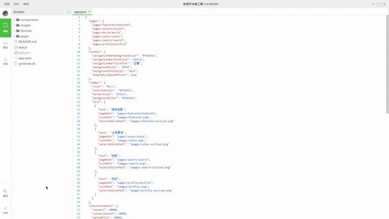
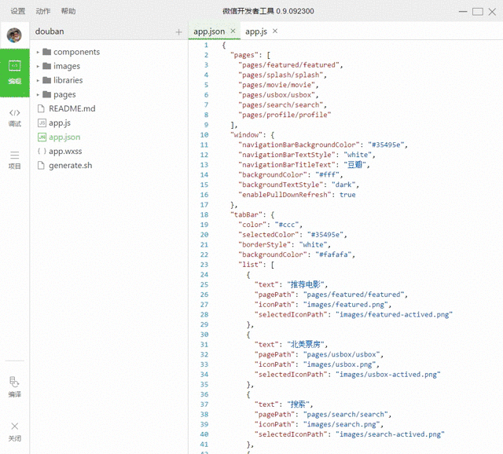

# 微信小程序demo（豆瓣电影）

> 由于时间的关系，没有办法写一个完整的说明，后续配合一些视频资料，请持续关注

<video src="./resources/video.mp4" controls="controls"></video>

[演示视频](./resources/video.mp4)

// 当前程序是由哪些页面组成的（第一项默认为初始页面）
// 所有使用到的组件或页面都必须在此体现
// 此处可以覆盖app.json中的window设置
