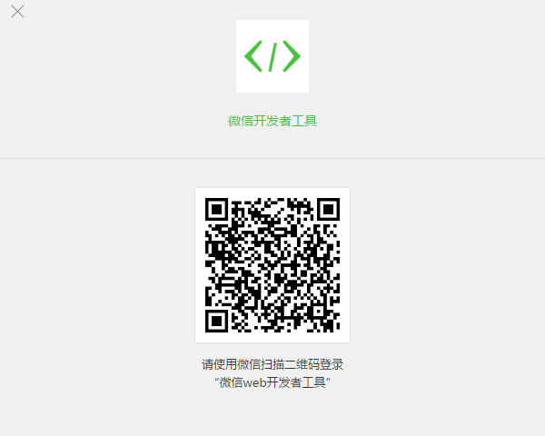
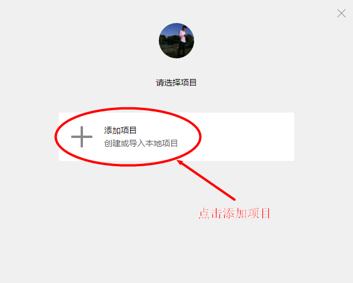
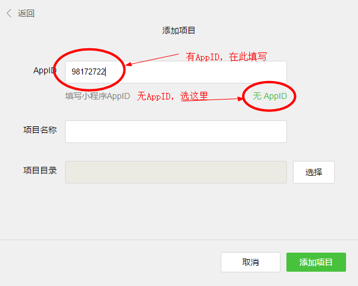
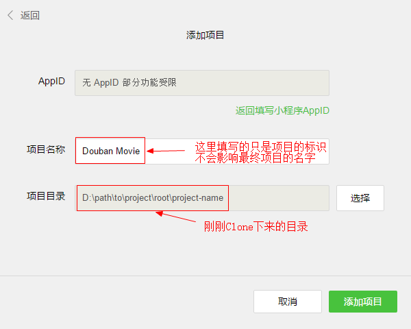
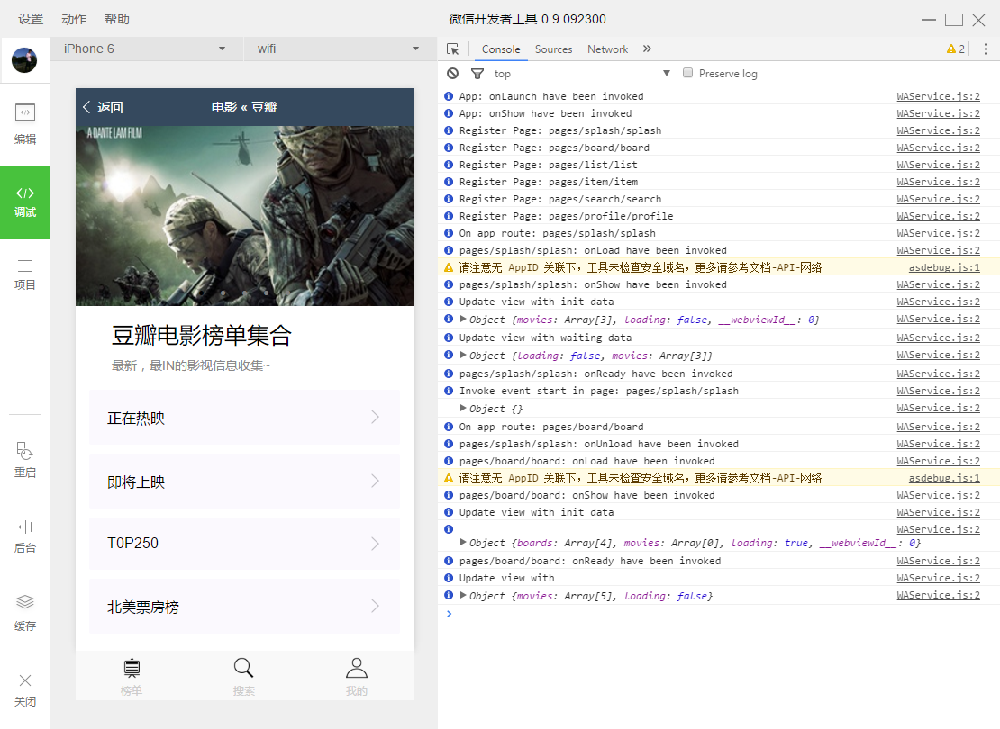
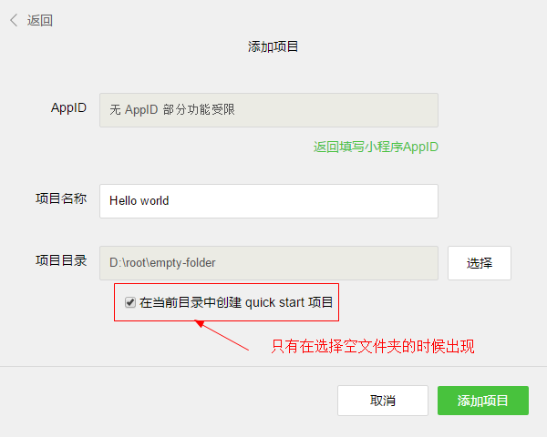
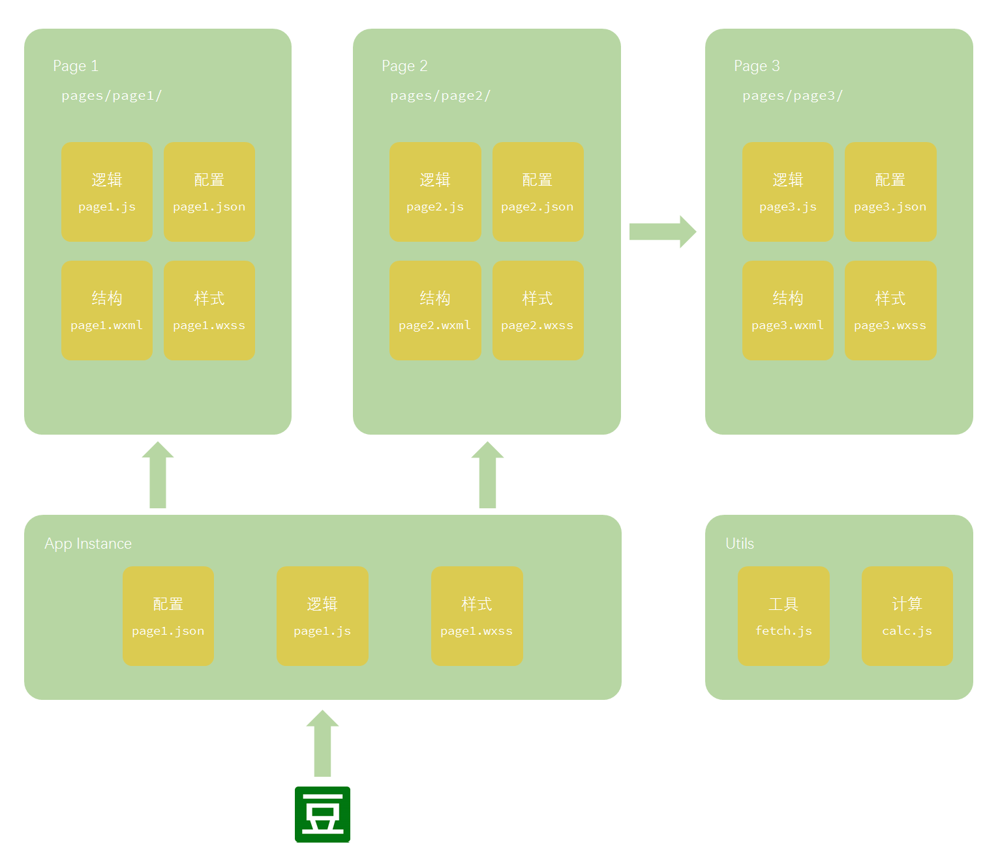
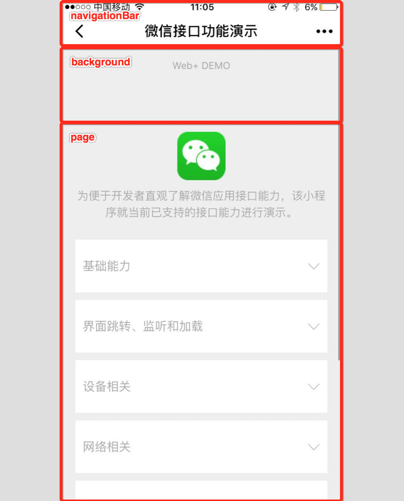

# 微信小程序开发教程

## 准备

### Demo 项目地址，主分支的代码已经更新，不能按照以下步骤运行

https://github.com/zce/weapp-demo/tree/backup

#### Clone or Download（需准备`GIT`环境）

```bash
$ cd path/to/project/root
$ git clone https://github.com/zce/weapp-demo.git project-name -b backup --depth 1
$ cd project-name
```

没有`git`环境，可以直接[下载](https://github.com/zce/weapp-demo/archive/backup.zip)


### 安装开发环境

#### 下载地址

- [Windows 64位](https://servicewechat.com/wxa-dev-logic/download_redirect?type=x64&from=mpwiki&t=1475052055457)
- [Windows 32位](https://servicewechat.com/wxa-dev-logic/download_redirect?type=ia32&from=mpwiki&t=1475052055457)
- [macOS](https://servicewechat.com/wxa-dev-logic/download_redirect?type=darwin&from=mpwiki&t=1475052055457)


#### 安装过程

对于Windows用户直接双击下一步的方式安装即可，此处注意我们使用的版本是官方最新的版本（不需要破解），可以不用AppID，也就是说没有资格的开发者也可以测试。


#### 环境测试以及演示项目

> 安装完成过后通过打开我们已经完成的应用测试环境是否正常

开发者工具安装完成后，打开并使用微信扫码登录。

<p align="center">
  
</p>

<p align="center">
  
</p>

选择创建“项目”，填入你在公众平台的`AppID`，如果没有的话可以点击`无AppID`。

<p align="center">
  
</p>

设置一个本地项目的名称（非小程序名称），比如`WeApp Demo`，并选择一个本地文件夹作为存储目录。

<p align="center">
  
</p>

接下来点击`新建项目`就可以在主界面中预览到我们的`豆瓣电影示例`了

<p align="center">
  
</p>


---

## 小程序开发初体验

### Hello world

希望是一个从零到一的转换过程~

#### 创建项目

接下来创建一个新的项目，理解小程序项目的基本结构和一些基础语法。

官方的开发工具为此准备了一个`QuickStart`项目。在创建过程中，如果选择的文件夹是个空文件夹，开发者工具会提示：是否需要创建一个`quick start`项目。选择`是`，开发者工具会自动帮助我们在开发目录里生成一个简单的项目。

<p align="center">
  
</p>

借助官方的`QuickStart项目`完成最基本的`Hello world`，理解小程序项目的基本结构，学习基础操作与语法。


#### 项目结构

```
└─ empty-folder/ ·································· 项目所在目录
   ├─ pages/ ······································ 页面目录
   │  ├─ index/ ··································· index页面
   │  │  ├─ index.js ······························ index页面逻辑
   │  │  ├─ index.wxml ···························· index页面结构
   │  │  └─ index.wxss ···························· index页面样式
   │  └─ logs/ ···································· logs页面
   │     ├─ logs.js ······························· logs页面逻辑
   │     ├─ logs.wxml ····························· logs页面结构
   │     └─ logs.wxss ····························· logs页面样式
   ├─ utils/ ······································ 公共脚本目录
   │  └─ util.js ·································· 工具脚本
   ├─ app.js ······································ 应用程序逻辑
   ├─ app.json ···································· 应用程序配置
   └─ app.wxss ···································· 应用程序公共样式
```

我简单的画了一个结构图：




#### 页面结构

每个页面组件也分为四个文件组成：

##### [page-name].js

页面逻辑文件，用于创建页面对象，以及处理页面生命周期控制和数据处理

##### [page-name].json

设置当前页面工作时的window的配置，此处会覆盖app.json中的window设置，也就是说只可以设置window中设置的属性

##### [page-name].wxml

> wxml指的是Wei Xin Markup Language

用于定义页面中元素结构的，语法遵循XML语法，注意是XML语法，不是HTML语法，不是HTML语法，不是HTML语法

##### [page-name].wxss

> wxml指的是Wei Xin Style Sheet

用于定义页面样式的，语法遵循CSS语法，扩展了CSS基本用法和长度单位（主要就是rpx响应式像素）


#### 项目配置

<p align="center">
  
</p>

> 相关链接：
> - [官方文档](https://mp.weixin.qq.com/debug/wxadoc/dev/framework/config.html)
> - [生成配置文件](https://weapptool.com/start.html)

小程序中的配置文件分为两种：

- 全局配置文件，根目录下的app.json
- 页面配置文件，每个页面目录下的[page-name].json

##### app.json

项目配置声明文件（指定项目的一些信息，比如导航栏样式颜色等等）

```javascript
{
  // 当前程序是由哪些页面组成的（第一项默认为初始页面）
  // 所有使用到的组件或页面都必须在此体现
  // https://mp.weixin.qq.com/debug/wxadoc/dev/framework/config.html#pages
  "pages": [ ... ],
  // 应用程序窗口设置
  // https://mp.weixin.qq.com/debug/wxadoc/dev/framework/config.html#window
  "window": { ... },
  // 应用导航栏设置
  // https://mp.weixin.qq.com/debug/wxadoc/dev/framework/config.html#tabBar
  "tabBar": { ... },
  // 网络超时设置
  // https://mp.weixin.qq.com/debug/wxadoc/dev/framework/config.html#networkTimeout
  "networkTimeout": {},
  // 是否在控制台输出调试信息
  // https://mp.weixin.qq.com/debug/wxadoc/dev/framework/config.html#debug
  "debug": true
}
```

##### [page-name].json

用于指定特定页面工作时，window的设置：

```javascript
{
  // 导航条背景色
  "navigationBarBackgroundColor": "#35495e",
  // 导航条前景色（只能是white/black）
  "navigationBarTextStyle": "white",
  // 导航条文本
  "navigationBarTitleText": "电影 « 豆瓣",
  // 窗口背景颜色
  "backgroundColor": "#fff",
  // 窗口前景色
  "backgroundTextStyle": "dark",
  // 是否开启下拉刷新
  "enablePullDownRefresh": true
}
```


### 逻辑层分析

#### 应用程序逻辑`app.js`

`app.js`作为项目主入口文件，用于创建应用程序对象

```javascript
// App函数是一个全局函数，用于创建应用程序对象
App({
  // ========== 全局数据对象（可以整个应用程序共享） ==========
  globalData: { ... },

  // ========== 应用程序全局方法 ==========
  method1 (p1, p2) { ... },
  method2 (p1, p2) { ... },

  // ========== 生命周期方法 ==========
  // 应用程序启动时触发一次
  onLaunch () { ... },

  // 当应用程序进入前台显示状态时触发
  onShow () { ... },

  // 当应用程序进入后台状态时触发
  onHide () { ... }
})
```

也就是说，当应用程序启动时会自动执行项目目录下的`app.js`文件。

在`app.js`中通过调用全局`App([option])`方法创建一个应用程序实例。

其中通过参数指定的一些特定的方法，会在特定的执行时机去执行，也就是说通常所说的生命周期事件方法。

属性 | 类型 | 描述 | 触发时机
-----|------|------|---------
onLaunch | Function | 生命周期函数--监听小程序初始化 | 当小程序初始化完成时，会触发 onLaunch（全局只触发一次）
onShow | Function | 生命周期函数--监听小程序显示 | 当小程序启动，或从后台进入前台显示，会触发 onShow
onHide | Function | 生命周期函数--监听小程序隐藏 | 当小程序从前台进入后台，会触发 onHide

也可以定义任意其他的对象成员（例如：方法和属性），这些成员可以在内部直接使用，或者外部通过获取`app`对象调用：

属性 | 类型 | 描述
-----|------|------
其他 | Any | 开发者可以添加任意的函数或数据到 Object 参数中，用 this 可以访问，一般用于存放业务逻辑配置，比如：API地址

app.js

```javascript
App({
  data1: '123',
  data2: { message: 'hello world' },
  api: {
    list: 'https://github.com/zce/',
    detail: 'https://github.com/zce/',
  },
  foo () {
    return 'bar'
  }
})
```

other.js

```javascript
// getApp 也是全局函数，可以在任意地方调用，用于获取全局应用程序实例对象
var app = getApp()
console.log(app.data1)
console.log(app.data2)
console.log(app.foo())
```


#### 页面逻辑`[page-name].js`

`[page-name].js`是一个页面的重要组成部分，用于创建页面对象

```javascript
// 获取全局应用程序对象
const app = getApp()

// Page也是一个全局函数，用来创建页面对象
Page({
  // ========== 页面数据对象（可以暴露到视图中，完成数据绑定） ==========
  data: { ... },

  // ========== 页面方法（可以用于抽象一些公共的行为，例如加载数据，也可以用于定义事件处理函数） ==========
  method1 (p1, p2) { ... },
  method2 (p1, p2) { ... },

  // ========== 生命周期方法 ==========
  // 页面加载触发
  onLoad () { ... }

  ...
})
```

在应用程序执行到当前页面时，会执行当前页面下对应的`[page-name].js`文件。
在`[page-name].js`中通过调用全局`Page([option])`方法创建一个页面实例。

##### `Page([option])`方法`[option]`参数说明

属性 | 类型 | 描述
---- | ---- | ----
data | Object | 页面的初始数据
onLoad | Function | 生命周期函数--监听页面加载
onReady | Function | 生命周期函数--监听页面初次渲染完成
onShow | Function | 生命周期函数--监听页面显示
onHide | Function | 生命周期函数--监听页面隐藏
onUnload | Function | 生命周期函数--监听页面卸载
onPullDownRefreash | Function | 页面相关事件处理函数--监听用户下拉动作
其他 | Any | 开发者可以添加任意的函数或数据到 object 参数中，用 this 可以访问


### 视图层分析

#### `[page-name].wxml`页面结构

`WXML（WeiXin Markup Language）`是`MINA框架`设计的一套标签语言，基于`XML`。

结合一些基础组件、事件系统、模板数据绑定，可以构建出页面的结构。

简单来说：wxml ≈ xml + 事件系统 + 模板引擎

例如：

```javascript
// js
Page({
  data: {
    todos: [
      { text: 'JavaScript', completed: false },
      { text: 'JavaScript+', completed: false },
      { text: 'JavaScript++', completed: false }
    ]
  },
  completed (e) { ... }
})
```

```xml
<!-- wxml -->
<view>
  <view wx:for="{{ todos }}">
    <block wx:if="{{ !item.completed }}">
      <text>{{ item.text }}</text>
      <button bindtap="completed" data-item-index="{{ index }}"> √ </button>
    </block>
  </view>
</view>
```


#### `[page-name].wxss`页面样式

`WXSS（WeiXin Style Sheets）`是`MINA框架`设计的一套标签语言，基于`XML`。

`WXSS`用来决定了在`WXML`中定义的组件应该怎么显示。

为了适应广大的前端开发者，我们的`WXSS`具有`CSS`大部分特性。 同时为了更适合开发微信小程序，我们对`CSS`进行了扩充以及修改。

与`CSS`相比我们扩展的特性有：

- 尺寸单位
- 样式导入（CSS也有）

##### 尺寸单位

rpx（responsive pixel）: 可以根据屏幕宽度进行自适应。规定屏幕宽为750rpx。如在 iPhone6 上，屏幕宽度为375px，共有750个物理像素，则750rpx = 375px = 750物理像素，1rpx = 0.5px = 1物理像素。

rem（root em）: 规定屏幕宽度为20rem；1rem = (750/20)rpx 。

设备 | rpx换算px (屏幕宽度/750) | px换算rpx (750/屏幕宽度) | rem换算rpx (750/20)
---- | ------------------------ | ------------------------ | ------------------------
iPhone5 | 1rpx = 0.42px | 1px = 2.34rpx | 1rem = 37.5rpx
iPhone6 | 1rpx = 0.5px | 1px = 2rpx | 1rem = 37.5rpx
iPhone6s | 1rpx = 0.552px | 1px = 1.81rpx | 1rem = 37.5rpx

> - **建议：** 开发微信小程序时设计师可以用 iPhone6 作为视觉稿的标准。
> - **注意：** 在较小的屏幕上不可避免的会有一些毛刺，请在开发时尽量避免这种情况。

##### 样式导入

使用`@import`语句可以导入外联样式表，`@import`后跟需要导入的外联样式表的相对路径，用`;`表示语句结束。

```css
@import "common.wxss";
text {
  background-color: #ff0;
}
```

##### 选择器

目前只支持如下选择器

选择器 | 样例 | 样例描述
------ | ---- | --------
.class | .intro | 选择所有拥有 class="intro" 的组件
#id | #firstname | 选择拥有 id="firstname" 的组件
element | view | 选择所有 view 组件
element, element | view | checkbox 选择所有文档的 view 组件和所有的 checkbox 组件
::after | view::after | 在 view 组件后边插入内容
::before | view::before | 在 view 组件前边插入内容

##### 全局样式与局部样式

定义在`app.wxss`中的样式为全局样式，作用于每一个页面。在`[page-name].wxss`文件中定义的样式为局部样式，只作用在对应的页面，并会覆盖`app.wxss`中相同的选择器。


---

## 小程序开发进阶

### UI组件使用


### API详解


### 模块化

小程序开发中，我们JS代码的组织方式就是以CommonJS的规范来组织


---


<style>
  p[align="center"] {
    box-shadow: 2px 2px 10px #ccc;
    background-color: #fafafa;
    padding: 20px;
    margin: 40px 20px;
  }
</style>
